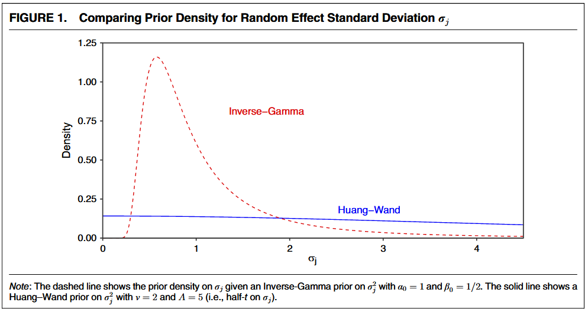
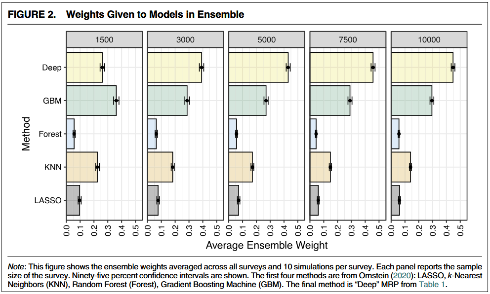
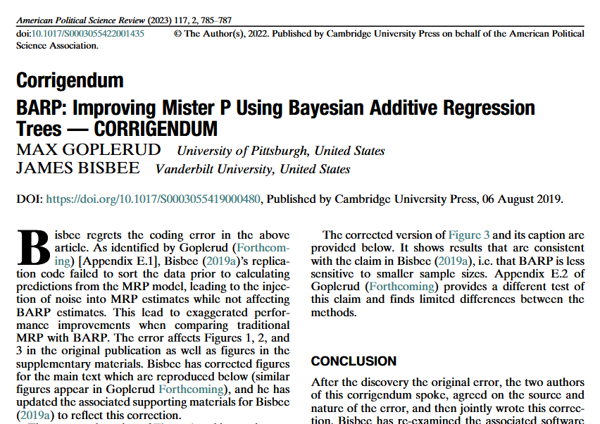
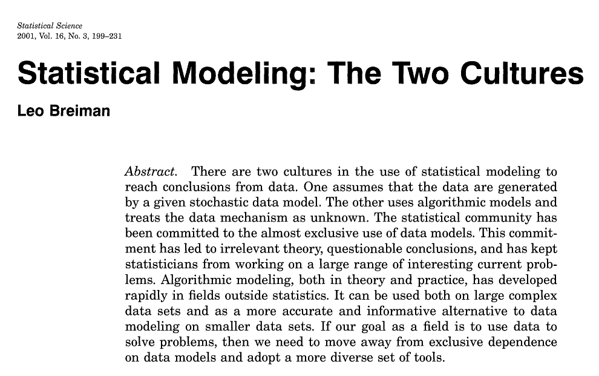
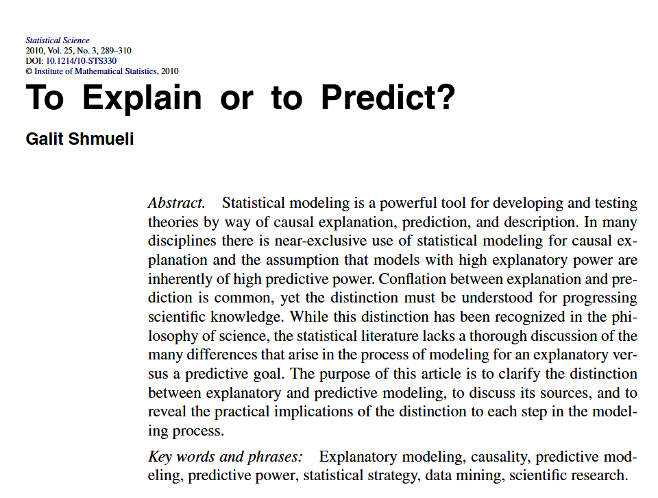

## Relembrando

#### MrP

A técnica de MrP envolve ($\approx$) duas etapas:

1. ajustamos um modelo de regressão multinível para estimar $\mathbb{P}(y_i = 1)$
2. usamos a probabilidade estimada para calcular as proporções na população (em termos de $N$)

#### Outras abordagens

Usar regressão multinível faz sentido, mas não é a única abordagem possível. Na prática, podemos optar por qualquer abordagem que estime probabilidades (por exemplo, árvores de decisão [@bisbee2019barp]).

De fato, outras abordagens podem ser preferíveis, inclusive por frequentemente serem não-paramétricas e naturalmente lidarem com interações não lineares entre as covariáveis.

<!-- > While the performance of MRP depends on _both_ steps, multiple papers have found that using machine learning for the predictive model outperforms traditional methods ("multilevel regression") by considerable margins. A plausible justification is that the linear, additive, nature of traditional models is insufficient to capture the complex relationship between the covariates and the outcome. [@goplerud2023reevaluating, p. 529] -->

## ⌛Bottleneck

Modelos multinível podem lidar com interações não-lineares a partir de termos interativos [@ghitza2013deep]. 
<!-- O pesquisador incorpora seu conhecimento de domínio para especificar quais interações serão incluídas no modelo. -->

O grande bottleneck desses modelos complexos (_deep_) é o **tempo** necessário para ajustá-los [@goplerud2023reevaluating].

- @goplerud2022variational mostra que podemos acelerar (e muito) o tempo de estimação usando inferência variacional (de várias horas para alguns minutos ou segundos); 

- @goplerud2023reevaluating expande testes de performance de modelos multinível contra modelos de machine learning (i) ajustando a escolha da priori sobre os parâmetros, (ii) usando _splines_ para capturar os efeitos não-lineares de covariáveis contínuas e (iii) aplicando _ensemble learning_.

> While recent work has reported that BART outperforms noticeably better than traditional MRP [@bisbee2019barp], I demonstrate that this is not the case. [@goplerud2023reevaluating, p. 530]

## A escolha da priori para $\sigma_j$

- Uma priori gama-inversa põe pouca probabilidade em valores próximos de 0 e, portanto, superestimamos o efeito aleatório
- A priori Huang-Wand põe mais peso em valores menores do efeito aleatório, permitindo maior regularização. Com efeito, o tempo de ajuste é "infinitamente" maior.

## Os dados e os modelos

Usa os mesmos dados de @butticehighton2013 -- o dataset com 89 _policy questions_. O modelo utilizado na ocasião, no entanto, é muito simples e não serve aos propósitos de @goplerud2023reevaluating, mesmo porque inclui apenas um termo interativo:

$$
\begin{align}
\mathbb{P}(y_i = 1) = \text{logit}^{-1}(
    &\beta_0 + 
    \beta_{\text{pvote}} \cdot \text{pvote}_{g[i]} +
    \beta_{\text{relig}} \cdot \text{relig}_{g[i]} + \\
    &\alpha^{\text{age}}_{g[i]} +
    \alpha^{\text{educ}}_{g[i]} +
    \alpha^{\text{gXr}}_{g[i]} +
    \alpha^{\text{state}}_{g[i]} +
    \alpha^{\text{region}}_{g[i]}
)
\end{align}
$$

$\alpha_g^j \sim \mathcal{N}(0, \sigma^2_j) \ \text{for all } j \ \text{and} \ g.$

O autor expande esse modelo em 3 versões:

1. Adiciona termos interativos entre covariáveis demográficas e geográficas;
2. Adiciona _splines_ (combinações de polinômios) para capturar efeitos não lineares;
3. A combinação de 1 e 2.

## Ensemble learning

Ao invés de usar os modelos de MRP especificados por si só, @goplerud2023reevaluating os combina a várias técnicas de _machine learning_ em um _ensemble_.

<!-- _Ensemble learning_ usa métricas que avaliam a capacidade de generalização para dar pesos aos modelos em uma combinação convexa. -->

Problema: pode ser mais difícil quantificar incerteza quando você combina vários modelos. Nesse caso, pesquisadores podem preferir usar um único modelo.

## O erro em @bisbee2019barp

> After some preliminary exploration, I discovered an error in @bisbee2019barp's replication archive. [...]. In brief, the error arbitrarily injected random noise into the MRP estimates at the prediction stage. When this is corrected, traditional MRP's performance increases markedly and is only slightly beaten by BART. [@goplerud2023reevaluating, p 533]

## Conclusões

1. Se o bottleneck de modelos multinível "profundos" (i.e., com muitos parâmetros a serem estimados) é o tempo necessário para ajustá-los, a inferência variacional é uma estratégia eficiente de lidar com o problema;

2. Modelos de _machine learning_, apesar de atrativos por serem não-paramétricos e aprenderem relações não-lineares de maneira eficiente, não necessariamente performam melhor que a modelagem multinível e podem ser mais difíceis de interpretar;

3. A combinação de várias técnicas (via _ensemble_) é uma boa estratégia para melhorar a capacidade preditiva. Ainda assim, os modelos de regressão multinível normalmente apresentam -- pelo menos em @goplerud2023reevaluating -- a maior capacidade de previsão fora da amostra.

## Sugestões

:::: {.columns}

::: {.column width="50%"}

:::

::: {.column width="50%"}

:::

::::

## Referências

::: {#refs}
:::
